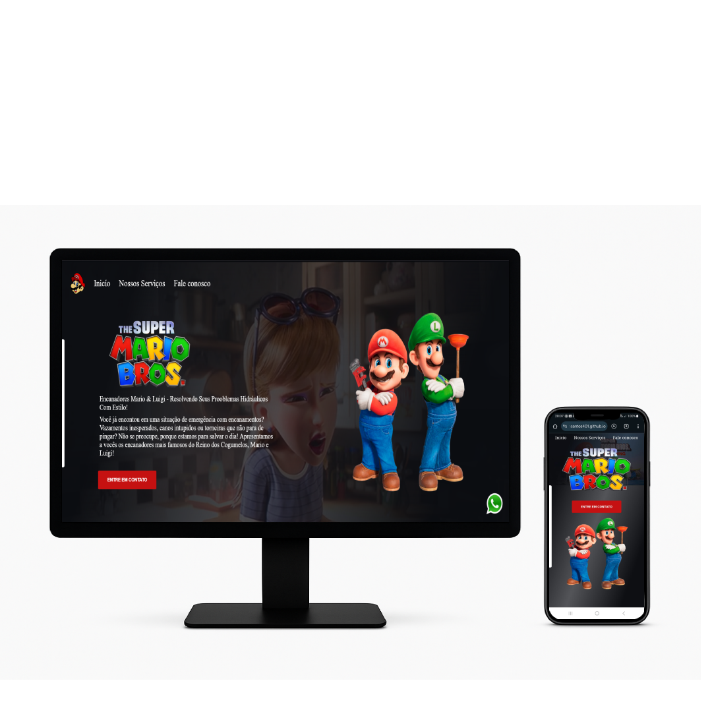

<h1>Projeto Super Mario 1</h1>

<h3>Projeto focado em atendimento ao cliente, resolvendo problemas hidráulicos.</h3>
<h3>Focado em responsividade e divertido para os clientes</h3>
 
## 🚀 Como Ver
Abra o <a href="https://alansantos401.github.io/Projeto-Mario-1/" target="_blank" rel="noopener noreferrer">Super Mario</a> no navegador e divirta-se!

## 📁 Tecnologias
- HTML5
- CSS3
- JavaScript puro

---
